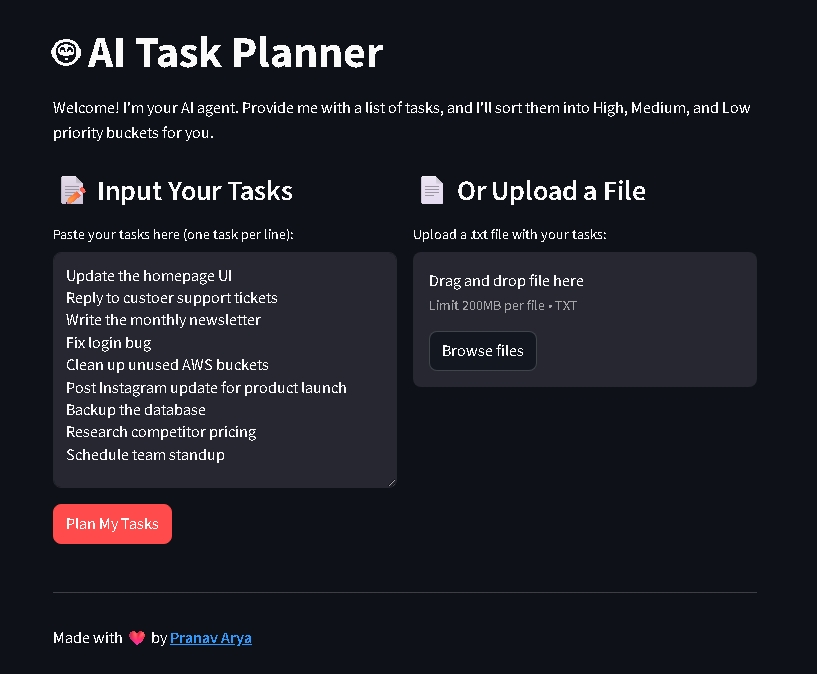
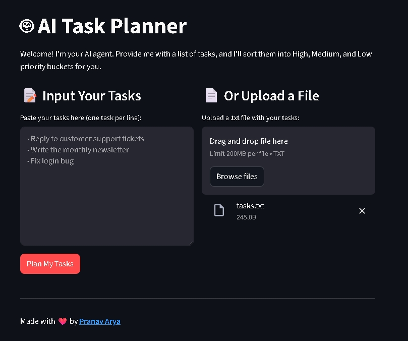
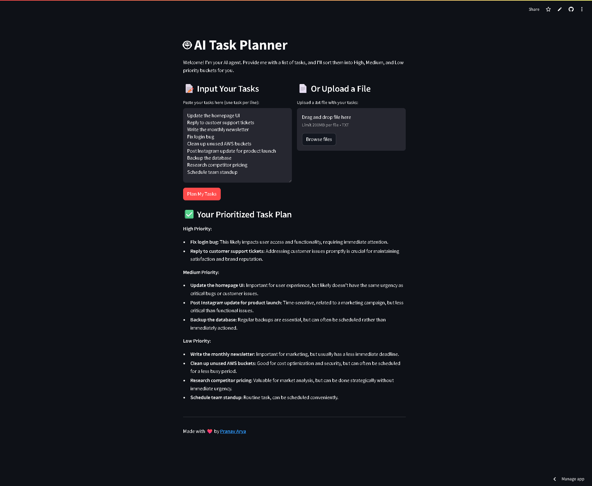

# 🤖 AI Task Planner

An intelligent web app that uses the **Google Gemini API** to automatically read a list of tasks and categorize them into **High**, **Medium**, and **Low** priority buckets.

### 🔗 [Live Demo](https://aitaskplanner.streamlit.app/)

## 🖼️ Screenshots

<table>
  <tr>
    <th>Manual Input</th>
    <th>File Upload</th>
  </tr>
  <tr>
    <td></td>
    <td></td>
  </tr>
  <tr>
    <th colspan="2" align="center">Full App with AI Output</th>
  </tr>
  <tr>
    <td colspan="2" align="center">
      
    </td>
  </tr>
</table>

---

## ✨ Features

- 🔹 **Intuitive Interface:** Clean and simple UI built with Streamlit
- 🔹 **Dual Input Options:** Paste tasks manually or upload a `.txt` file
- 🔹 **AI-Powered Prioritization:** Uses Google Gemini to analyze and sort tasks
- 🔹 **Formatted Output:** Tasks are clearly categorized for quick understanding

---

## 🛠️ Tech Stack

- **Backend:** Python  
- **AI Model:** Google Gemini API (`gemini-1.5-flash`)  
- **Web Framework:** Streamlit  
- **Deployment:** Streamlit Community Cloud  

---

## 🚀 Getting Started (Run Locally)

### 1. Clone the Repository

```bash
git clone https://github.com/PranavArya37/AI-Task-Planner.git
cd AI-Task-Planner
````

### 2. Set Up a Virtual Environment

#### On Windows

```bash
python -m venv venv
venv\Scripts\activate
```

#### On macOS/Linux

```bash
python3 -m venv venv
source venv/bin/activate
```

### 3. Install Dependencies

```bash
pip install -r requirements.txt
```

### 4. Set Up Environment Variables

Create a `.env` file in the root directory:

```env
GEMINI_API_KEY="your_actual_api_key_here"
```

### 5. Run the App

```bash
streamlit run app.py
```

The app will automatically open in your browser at `http://localhost:8501`.

---

## ☁️ Deployment

This app is deployed using **Streamlit Community Cloud**.
Environment variables are managed securely via Streamlit's secrets management, and dependencies are installed from `requirements.txt`.

---

## 🙋 Contributing

Contributions are welcome!
If you have suggestions or improvements, feel free to fork the repo and open a pull request.

---

## 🧑‍💻 Author

🌐 [Pranav Arya](https://pranavarya.in)

📫 Get in touch via [LinkedIn](https://www.linkedin.com/in/pranavarya37/) or [Twitter](https://twitter.com/pranavarya37)

---

## 📝 License

This project is licensed under the MIT ```License```. See the LICENSE file for details.
